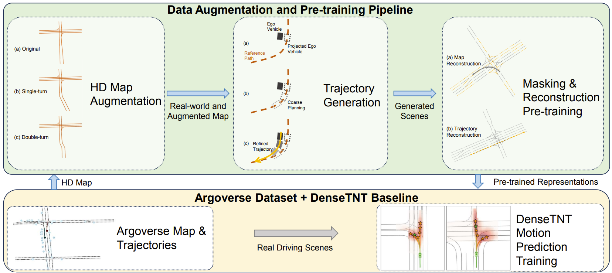

# Pretraining on Synthetic Driving Data for Trajectory Prediction

*Yiheng Li, Seth Z. Zhao, Chenfeng Xu, Chen Tang, Chenran Li, Mingyu Ding, Masayoshi Tomizuka, Wei Zhan*

Official Repo for IROS 2024 paper Pre-training on Synthetic Driving Data for Trajectory Prediction (https://arxiv.org/pdf/2309.10121).

## Repo Structure

In this repo, we present the generated dataset we built for pre-training, as well as our pre-training and fine-tuning pipeline with combined reconstruction setting. Note that the trajectory reconstruction and map reconstruction can be realized easily by minimal modification to the presented version. The pipeline is illustrated below:



* `Pretrain_Data_360k_Aug_Orig` contains the pre-training data we generated on both original and augmented maps. Those motion data files on augmented map are started with `augmap`.
* `src` contains the source code for pre-training and fine-tuning.
* `pretrain` contains the pre-trained models, visualizations and source code we used when doing our experiments.
* `finetune` contains the fine-tuned models, source codes, and evaluation logs we used when doing our experiments.

## Usage

* 1. Please first refer to `Quick Start` part in denseTNT repo (https://github.com/Tsinghua-MARS-Lab/DenseTNT) for preparing environment.
* 2. Please refer to `bash` where we provide bash commands for using the code.

## Performances

In our experiments, we see the benefits of our pipeline as followed:

| Method                 | $MR_6$(%) | $minFDE_6$ | $minADE_6$ |
|------------------------|-------------------------|---------------------------|---------------------------|
| Baseline               | 9.73                    | 1.0673                    | 0.8052                    |
| Map Reconstruction     | **9.20 (-5.45%)**       | 1.0343 (-3.09%)           | 0.7571 (-5.97%)           |
| Trajectory Reconstruction | 9.24 (-5.04%)         | **1.0263 (-3.84%)**       | 0.7384 (-8.30%)           |
| Combined Reconstruction  | 9.27 (-4.73%)          | 1.0349 (-3.04%)           | **0.7284 (-9.54%)**       |

Where the checkpoints of combined reconstruction pre-training has been provided in this repo.

## Acknowledgement

This implementation is based on DenseTNT (https://github.com/Tsinghua-MARS-Lab/DenseTNT). This work was supported by Berkeley DeepDrive.

## Citation

```
@inproceedings{li2023pretrainingsyntheticdrivingdata,
  title={Pre-training on Synthetic Driving Data for Trajectory Prediction},
  author={Yiheng Li and Seth Z. Zhao and Chenfeng Xu and Chen Tang and Chenran Li and Mingyu Ding and Masayoshi Tomizuka and Wei Zhan},
  booktitle={2024 IEEE/RSJ International Conference on Intelligent Robots and Systems (IROS)},
  year={2024},
  organization={IEEE}
}
```
